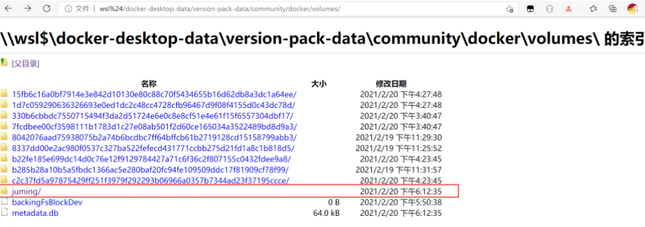

# Docker 安装软件脚本聚合

- [强力推荐 史上最全的 Docker 教程](https://blog.csdn.net/agonie201218/category_10180909.html)

- [官网 hub.docker.com](https://hub.docker.com/)

> 最全的 docker 官方镜像库

### Docker 各种应用安装方式

- [elasticsearch](https://github.com/andanyoung/docker/tree/master/elasticsearch)

# windows wsl 安装 docker 需要注意事项

## 1 wsl

### 1.1 简介

WSL 是 Windows subsystem linux 的简称，可以到 Microsoft Store 下载你喜欢的发行版，貌似目前最流行的也只有 ubuntu

- 注意 wsl 目前已经出了 wsl2 了，还处在 wsl1 的朋友可以升级下

### 1.2 常用命令

#### 1.2.1 启动默认发行版

`wsl`

#### 1.2.2 启动指定发行版

`wsl -d Ubuntu`

### 1.2.3 查看所有安装的发行版

`wsl --list`

`wsl -l`

#### 1.2.4 查看正在运行的发行版

`wsl --list --running`

#### 1.2.5 设置默认发行版

`wsl -s Ubuntu`

# Docker Desktop for Windows（WSL2）数据卷 volumes 存放位置及如何访问

> 目前使用的工具是 Docker Desktop(Switch to Linux Containers…)。当学习到具名挂载的时候，即使得到了数据卷的位置，也无法直接访问到数据卷。

- 如我把 MySQL 挂载在`/var/lib/docker/volumes/mysql57/_data`中， 但实际情况是不可达的

  ```
  gin@DESKTOP-0OLODQ2:/$ cd /var/lib/docker/volumes/juming/_data
  -bash: cd: /var/lib/docker/volumes/juming/_data: No such file or directory
  ```

## 解决

在浏览器访问以下指令可以进入.vhdx 中

```
\\wsl$\docker-desktop
\\wsl$\docker-desktop-data
```

我们想要访问的是数据卷的位置

```
\\wsl$\docker-desktop-data\version-pack-data\community\docker\volumes\
```

在这里可以看到一开始创建的 juming 数据卷



# 参考链接

[迁移 Docker 镜像和容器的存储位置](https://dev.to/kimcuonthenet/move-docker-desktop-data-distro-out-of-system-drive-4cg2).

[GitHub 上的讨论:WSL2 where is docker volume location?](https://github.com/microsoft/WSL/discussions/4176)
